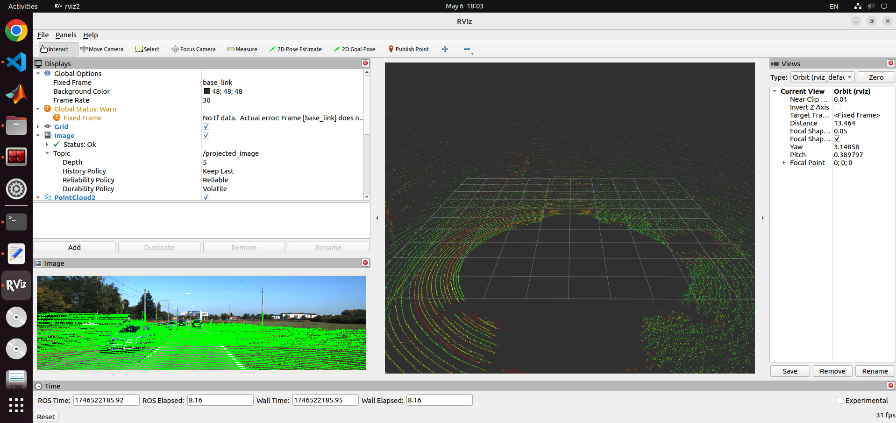

# hw1_kitti_projection
This repo is a project for implementing a ROS2 node class that subscribes camera and LiDAR topics, and then projects the point cloud data onto the RGB image, later publishing the result by RViz2.

## 🛠 My Environment
|Settings|Version|
|------|---|
|OS|Ubuntu 22.04.5 LTS|
|Language|C++|
|ROS2|Humble|
|PCL|1.12.1|
|OpenCV|4.5.4|
|Eigen|3.4.0|

## 🛠 Before Start
### ✨ KITTI Dataset Download
- https://www.cvlibs.net/datasets/kitti/raw_data.php

### ✨ Used Data
- 2011_09_26_drive_0015 (1.2GB) Data

    - [synced+rectified data]
    - [calibration]

## 🛠 Setup
### 1. Download or clone this repo under the {ROS_Workspace/src} folder.
~~~ bash
$ cd ~/ros2_ws/src
$ git clone https://github.com/DayeonSeo416/hw1_kitti_projection.git
~~~

### 2. After downloading the dataset, create the folder named "data" in the workspace, and extract the dataaset in the data folder.
~~~ bash
ex) /home/USER/ros2_ws/data/2011_09_26/2011_09_26_drive_0015_sync/...
~~~
#### Note that the folder tree should look like this :
~~~ text
.ros2_ws
├ build
├ data
├─────├ 2011_09_26
├─────────────────├ 2011_09_26_drive_0015_sync
├─────────────────────────────────────────────├ image_00
├─────────────────────────────────────────────├ image_01
├─────────────────────────────────────────────├ image_02
├─────────────────────────────────────────────├ image_03
├─────────────────────────────────────────────├ oxts
├─────────────────────────────────────────────├ velodyne_points
├─────────────────├ calib_cam_to_cam.txt
├─────────────────├ calib_imu_to_velo.txt
├─────────────────├ calib_velo_to_cam.txt
├ install
├ log
├ src
├────├ hw1_kitti_projection
├──────────────────────────├ CMakeLists.txt
├──────────────────────────├ default.rviz
├──────────────────────────├ package.xml
├──────────────────────────├ README.md
├──────────────────────────├ src
├───────────────────────────────├ kitti_publisher_node.cpp
├───────────────────────────────├ lidar_to_image_projection_node.cpp
~~~

### 3. If you want to use the other dataset, modify the path in each of the cpp file.
~~~ bash
//* Modify the path of the dataset *//

- kitti_publisher_node.cpp

lidar_dir_="/home/USER/ros2_ws/data/2011_09_26/2011_09_26_drive_0015_sync/velodyne_points/data";
image_dir_="/home/USER/ros2_ws/data/2011_09_26/2011_09_26_drive_0015_sync/image_02/data";

- lidar_to_image_projection_node.cpp

std::ifstream velo_to_cam_file("/home/dayeon/ros2_ws/data/2011_09_26/calib_velo_to_cam.txt");
std::ifstream cam_to_cam_file("/home/dayeon/ros2_ws/data/2011_09_26/calib_cam_to_cam.txt");
~~~

## 🛠 How to Build
~~~ bash
$ cd ~/ros2_ws
$ colcon build --packages-select hw1_kitti_projection

$ source install/setup.bash

$ ros2 run hw1_kitti_projection kitti_publisher_node
$ ros2 run hw1_kitti_projection lidar_to_image_projection_node
$ rviz2
~~~

## 🛠 Visualize RViz2
You could import the "default.rviz" file into the Rviz2.

